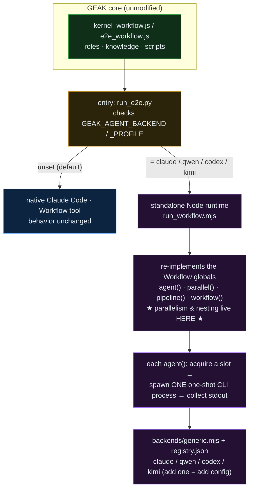
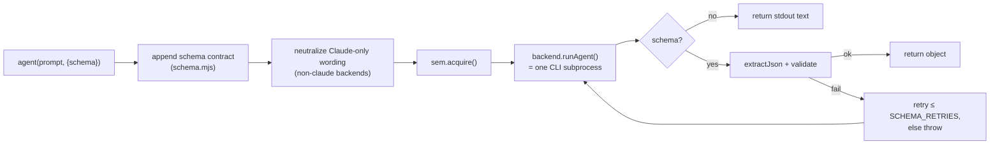
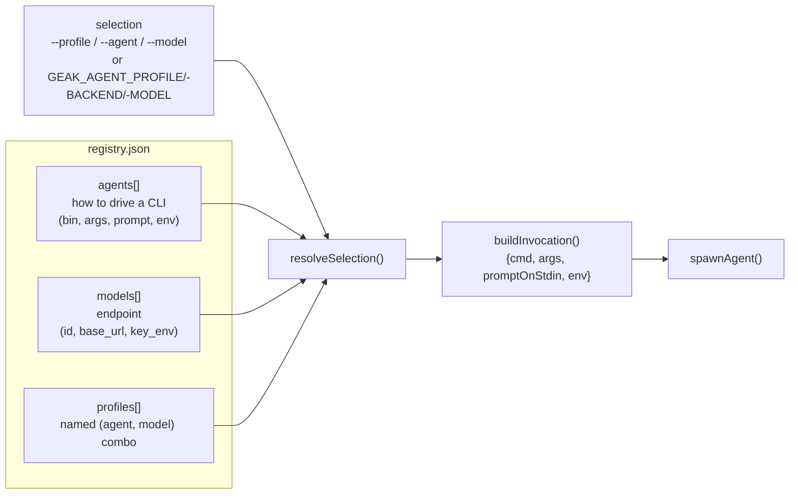
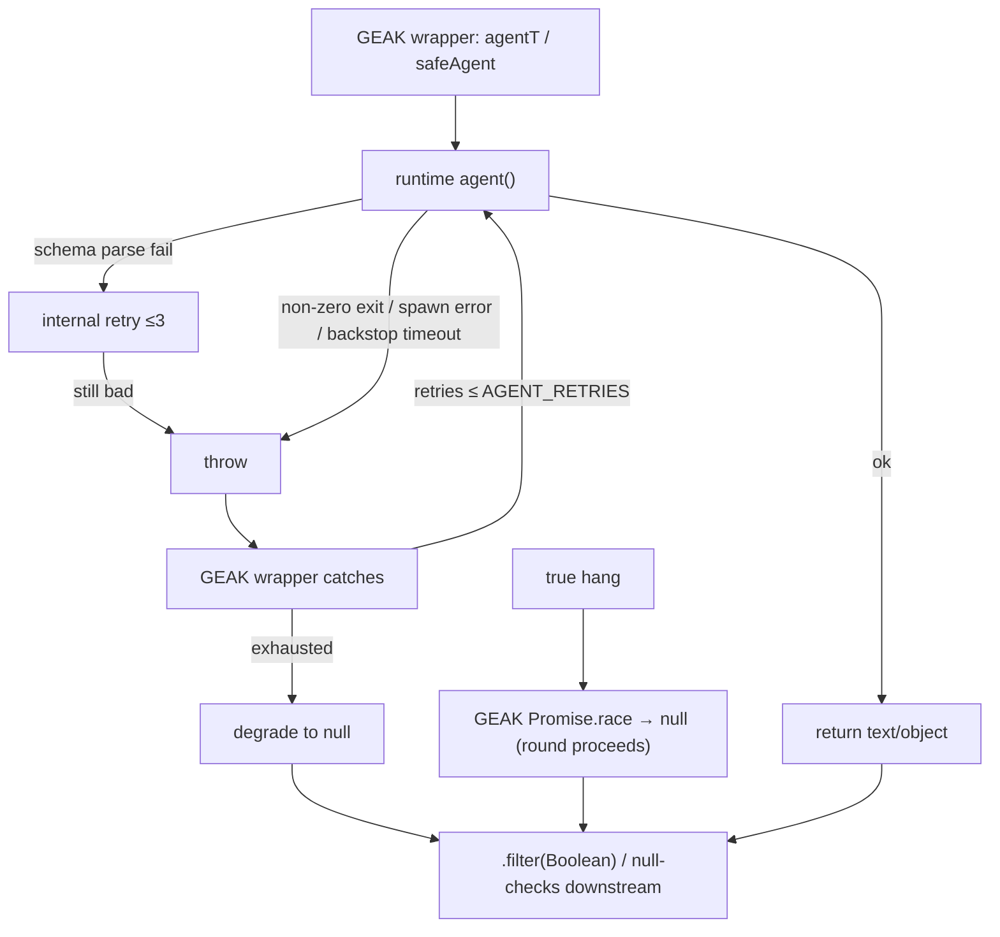

# GEAK Swappable Code-Agent Backends — Design & Implementation

> Status: implemented on branch `feat/swappable-agent-backends`.
> Scope: `interface/runtime/` (the standalone runtime) + the one-switch routing in
> `interface/run_e2e.py`. The GEAK workflows, roles, knowledge and scripts are
> **used byte-for-byte unmodified**.
>
> Read this in a Markdown viewer with Mermaid support (Cursor: `Cmd/Ctrl+Shift+V`).

---

## 1. Background & problem

GEAK's orchestration (`kernel_workflow/kernel_workflow.js`, `e2e_workflow/e2e_workflow.js`)
is plain JavaScript. But those scripts **call a set of globals they never define or
import**:

```js
agent()  parallel()  pipeline()  workflow()  phase()  log()   args   budget
```

These globals are **private to Claude Code's `Workflow` tool** — the harness injects them
into the script's scope before running it. A quick proof: the scripts call `phase('Setup')`,
`await pipeline(...)`, `await agent(...)` with **no `import`/`require`** anywhere. Run such a
file under a bare Node process and you get `ReferenceError: agent is not defined`.

Consequence: **the GEAK workflows can only run inside Claude Code.** They cannot run under
any other coding-agent CLI (qwen-code / codex / kimi), which blocks:

- using GEAK where Claude Code isn't available or desired, and
- **controlled (agent × model) comparison experiments** — the whole point of being able to
  ask "does GEAK produce the same wins under a different agent/model?"

Two extra obstacles make a naive port impossible:

1. **Parallelism & nesting.** GEAK relies on `parallel()`/`pipeline()` fan-out and one level
   of `workflow()` nesting (e2e recursively calls the kernel layer). CLIs like qwen-code
   cannot themselves orchestrate parallel or nested sub-agents.
2. **Structured output.** Almost every `agent()` call passes a `schema` and expects a
   validated JSON object back. Claude Code guarantees this via a *forced* `StructuredOutput`
   tool; a generic CLI has no such mechanism.

---

## 2. Goals / non-goals

**Goals**

- Run the **unmodified** GEAK workflows under a pluggable code-agent backend (claude / qwen /
  codex / kimi / …), selected by **one environment variable**.
- Keep the **default path (native Claude Code / Workflow tool) byte-for-byte unchanged.**
- Own **parallelism and one-level nesting in the runtime**, so a backend CLI only has to
  "run one prompt to completion and print the result."
- **Behavioral parity** with native Claude Code: swapping the backend must not silently change
  what GEAK computes (so experiment results are trustworthy).
- Adding a new CLI = a **registry entry, zero code**.

**Non-goals**

- Reproducing Claude Code's chat-level natural-language entry (NL → pick workflow → extract
  args). That's a model capability; the runtime is invoked with explicit args. See §9.
- A full JSON-Schema validator. The emulation validates the subset GEAK depends on (§8).
- Token/cost accounting. Deliberately omitted; metrics are structural (agent count, schema
  failures, wall time).
- Resume/caching (`resumeFromRunId`). GEAK checkpoints its own progress via `STATE_DIR`.

---

## 3. High-level architecture



The key inversion: **complexity that the Claude Code harness provides as a privilege
(orchestration, structured output, concurrency, budget) is pushed down into an ordinary Node
process.** The backend CLI is demoted to a stateless one-shot worker.

---

## 4. Design principles

1. **Don't touch GEAK.** All adaptation happens in the runtime layer or in `registry.json`
   data — never in `*.js` / roles / knowledge. This keeps the native path pristine and makes
   experiments fair (same scripts, only the backend varies).
2. **The runtime owns orchestration; the backend runs one prompt.** This is what makes
   non-orchestrating CLIs (qwen-code) usable at all.
3. **Config over code.** agents × models × profiles are registry data; a new CLI is a data
   entry. A hand-written `backends/<name>.mjs` is an escape hatch, not the norm.
4. **Parity is a first-class requirement.** Every primitive is checked against the authoritative
   Workflow-tool contract (§10). Divergences are either fixed, guarded, or documented — never
   left to chance.
5. **Testable without a GPU / network / real CLI.** The primitives are exported and unit-tested
   against a fake backend (`selftest.mjs`).

---

## 5. The Workflow primitive contract (what GEAK depends on)

GEAK actually uses **7 injected globals meaningfully**, plus one required-but-unused stub:

| Global | Purpose in GEAK | kernel uses | e2e uses |
|---|---|---|---|
| `agent(prompt,{schema,label,...})` | dispatch one agent, get structured result | ✓ | ✓ |
| `parallel(thunks)` | run a batch concurrently, barrier | ✓ | ✓ |
| `pipeline(items,...stages)` | per-item multi-stage, no barrier between stages | ✓ | ✓ |
| `workflow(ref,args)` | run another script inline (one level) | — | ✓ (e2e→kernel) |
| `phase(title)` / `log(msg)` | progress grouping / logging | ✓ | ✓ |
| `args` | inputs passed to the script | ✓ | ✓ |
| `budget` | token budget — **stub only; never read** | — | — |

Note: GEAK's scripts contain a variable also called `budget`, but it is GEAK's own **time**
budget (from `args.time_budget_s`), unrelated to the Workflow tool's token `budget`. A grep for
`budget.total|spent|remaining` finds zero hits, which is why the stub is safe.

`agentType`, `effort`, `isolation`, `cwd`, `env` opts and name-based `workflow()` lookup are
**not used** by GEAK (verified by grep), so the runtime need not implement them faithfully.

---

## 6. Runtime implementation (`run_workflow.mjs`)

### 6.1 Script loader — running an unmodified `.js`

The scripts begin with `export const meta = {...}` and end with a top-level `return {...}`.
Neither is legal in a plain module the way we execute it, so:

```js
// toRunnableBody(): strip the single leading `export ` before a JS declaration keyword.
src.replace(/^[ \t]*export\s+(?=(const|let|var|function|class|async|default)\b)/gm, '')
```

The stripped body is compiled into an `AsyncFunction` whose **parameters are the primitive
names**, then invoked with the runtime's implementations:

```js
fn = new AsyncFunction('agent','parallel','pipeline','phase','log','workflow','args','budget', body);
return fn(agent, parallel, pipeline, phase, log, makeWorkflow(depth), scriptArgs, budget);
```

This is the whole trick: the script's "bare globals" become function parameters bound to our
JS. Running inside an `AsyncFunction` also makes the script's top-level `return` the workflow's
result, and top-level `await` legal.

> **Sharp edge (documented):** the `export`-strip regex is line-anchored and *not*
> string-context-aware. A `export const foo` on its own line *inside a prompt template literal*
> would be mangled. Currently no GEAK script does this (only the top-level `export const meta`
> matches). Flagged as latent; see §14.

### 6.2 `agent()`



- No schema → returns the backend's stdout text (string).
- With schema → appends a strict JSON contract (§8), extracts + validates, and **retries
  internally** (`SCHEMA_RETRIES+1`, default 3) before throwing.
- Lifetime backstop: `++state.spawned > 1000` throws (matches the Workflow tool).
- Concurrency: bounded by a counting semaphore (§6.5).

### 6.3 `parallel()` and `pipeline()`

```js
// parallel: barrier; a throwing thunk resolves to null (call never rejects)
Promise.all(thunks.map(t => Promise.resolve().then(t).catch(() => null)))

// pipeline: per-item, NO barrier between stages; each stage gets (prev, item, idx);
//           a throwing stage drops that item to null and skips its remaining stages
Promise.all(items.map(async (item, idx) => {
  let prev = item;
  for (const st of stages) { try { prev = await st(prev, item, idx); } catch { return null; } }
  return prev;
}))
```

`pipeline` is the important one: item A can be in stage 3 while item B is still in stage 1
(wall-clock = slowest single chain, not sum-of-slowest-per-stage). Both match the Workflow
tool exactly, including the throw→null degradation that GEAK's `.filter(Boolean)` relies on.

### 6.4 `workflow()` — one-level nesting

`makeWorkflow(depth)` returns a `workflow(ref, args)` that re-enters `runScript` at `depth+1`,
throwing if `depth >= MAX_NESTING (=1)`. The nested run **shares the same semaphore and the same
`state.spawned` counter** — so e2e→kernel is subject to one global concurrency cap and one
lifetime cap, exactly as native. (Verified: `kernel_workflow.js` does not itself call
`workflow()`, so e2e→kernel is exactly one level.)

### 6.5 Concurrency — counting semaphore

```js
class Semaphore {
  acquire() { return new Promise(res => this.free > 0 ? (this.free--, res()) : this.waiters.push(res)); }
  release() { const w = this.waiters.shift(); w ? w() : this.free++; }   // hand slot straight to a waiter
}
```

Default cap = `min(16, cpus-2)` (`defaultConcurrency`, matches the Workflow tool). The slot is
**conserved on hand-off** (a released slot goes directly to a waiter without touching `free`), so
there is no leak or lost-wakeup. Passing 100 items to `parallel` is fine — only ~cap run at once.

### 6.6 `phase` / `log` / `args` / `budget`

- `phase`/`log` write to **stderr** (native routes them to the `/workflows` progress UI, which
  doesn't exist here). stdout is reserved for the final `WORKFLOW_RESULT <json>` and
  `WORKFLOW_METRICS <json>` lines so results stay machine-parseable.
- `args` is injected verbatim.
- `budget` is a stub `{total:null, spent:()=>0, remaining:()=>Infinity}` — `total:null` makes
  budget-guarded loops fall to their non-budget path, matching "no target set." GEAK never reads
  it (§5).

---

## 7. Backend abstraction

### 7.1 The contract (`backends/base.mjs`)

A backend turns **one `agent()` call into one one-shot subprocess**. It exports:

```
name: string
async runAgent({ prompt, label, cwd, env, model, timeoutMs }) -> { text }
```

It knows nothing about parallelism, phases, budgets, or nesting — those are the runtime's job.
The shared `spawnAgent()` helper feeds the prompt on **stdin** (avoids ARG_MAX), collects
stdout/stderr, and enforces a hard timeout. A non-zero exit becomes a thrown error so the
runtime's retry/degrade path handles it.

### 7.2 Generic, config-driven backend (`backends/generic.mjs`)

One backend drives **any** CLI from a resolved registry recipe — the differences (binary,
flags, prompt delivery, env) live in `registry.json` data, not code. Escape hatch:
`run_workflow.mjs` prefers a hand-written `backends/<name>.mjs` if one exists.

### 7.3 Config resolution (`config.mjs` + `registry.json`)

Two orthogonal axes plus a pin:



Precedence (applied by the caller): CLI flag > env > registry `default_profile`.
`buildInvocation()` assembles the concrete argv: auto-approve flag, model flag+id, base_url
routed to the CLI's dialect env, prompt on stdin or as the last arg.

### 7.4 Prompt neutralization

GEAK's role prompts contain Claude-specific wording ("a StructuredOutput tool is forced") that
misleads a non-claude CLI. `neutralizeForBackend()` string-replaces these for non-claude
backends **without editing roles/`.js`**. It is a no-op for claude (native wording is correct).

---

## 8. Structured-output emulation (`schema.mjs`)

Native Claude Code forces a `StructuredOutput` tool → the returned object is guaranteed to
validate. A generic CLI has no such tool, so we emulate:

1. **Append a strict contract** (`schemaInstruction`): "do all work first, then output your
   result as a **single ```json fenced block** as the very last thing, validating against this
   schema."
2. **Extract** (`extractJson`): prefer the *last* ```json fenced block, then the last fenced
   block that parses, then the last balanced `{...}`/`[...]` that parses (string/escape-aware).
3. **Validate** (`validate`): a lightweight checker covering the subset GEAK uses — top-level
   `type`, `required`, recursion into `properties`/`items`, and **`enum`** membership.

`enum` matters: GEAK branches on exact enum strings (director `specialty`, e2e
`outcome`/`status`). Without enum checking, an out-of-enum value would pass here where native
would reject+resample, silently mis-routing logic. It is enforced (deep-equal membership).

> **Deliberate gaps:** `additionalProperties`, numeric ranges, `pattern`, `oneOf/anyOf` are not
> checked — GEAK doesn't use them (grep) and enforcing them adds no parity value. This is the
> one **inherent** non-parity: the success path is best-effort emulation, not a hard guarantee.
> See §10 R1 and §14.

---

## 9. Entry points

| Level | Native Claude Code (default) | Swapped backend (runtime) |
|---|---|---|
| kernel | one NL prompt: *"use .../kernel_workflow to optimize .../knn"* | one command: `node run_workflow.mjs kernel_workflow/kernel_workflow.js --profile qwen --args '{...}'` |
| e2e | one NL prompt: *"use .../e2e_workflow to optimize inference for /models/…, sglang, …"* | one command: `GEAK_AGENT_PROFILE=qwen python run_e2e.py handoff.json result.json` |

**How the native "one prompt" works.** With `enableWorkflows`+`ultracode` enabled, Claude Code
(the model) reads the NL, uses the path in the prompt to pick the script and the script's
`meta.whenToUse` to know which `args` to extract, then calls the `Workflow` tool with
`{scriptPath, args}`. The NL → `(script, args)` mapping is a **model capability**, not something
the runtime reproduces.

**`run_e2e.py` routing.** `run_e2e.py` reads `handoff.json`, maps its stable fields onto
`e2e_workflow.js` args, and then either invokes the native Workflow tool (backend unset,
byte-for-byte unchanged) or shells out to `run_workflow.mjs` (backend/profile set). It performs
no NL understanding — that step only exists in the interactive native path.

**Experiments (`experiment.mjs`).** Runs the same script + args through every `(agent, model)`
combo, N repeats, and writes `results.jsonl` / `summary.md` / `summary.csv` (speedup /
success-rate / wall; no token/cost). This is the payoff of the whole design.

---

## 10. Parity with native Claude Code

The audit compares each documented Workflow-tool behavior against the runtime, and against
whether GEAK actually exercises it.

| Behavior | Native | Runtime | GEAK exercises? | Status |
|---|---|---|---|---|
| `parallel` barrier + throw→null | ✔ | ✔ | yes | ✅ aligned |
| `pipeline` no-barrier + `(prev,item,idx)` + throw→null | ✔ | ✔ | yes | ✅ aligned |
| concurrency cap `min(16,cpu-2)` | ✔ | ✔ | yes | ✅ aligned |
| lifetime cap 1000 agents | ✔ | ✔ | no | ✅ aligned |
| `workflow()` one level + shared cap/counter | ✔ | ✔ | yes (e2e→kernel) | ✅ aligned |
| `args` verbatim | ✔ | ✔ | yes | ✅ aligned |
| `effort` / `isolation` / `agentType` opts | supported | ignored | **no** | ✅ irrelevant |
| `budget.total/spent/remaining` | real | stub | **no** | ✅ irrelevant |
| resume (`resumeFromRunId`) | yes | none | no (self-checkpoints via STATE_DIR) | ✅ irrelevant |
| `agent()` terminal failure | returns **null** | **throws** | yes, but GEAK wrappers tolerate both | 🟡 converges to null; retry counts differ |
| `Date.now`/`Math.random`/`new Date` in script | **throw** | allowed | **no** (GEAK avoids them) | 🟡 latent — no runtime guard |
| Node/FS API (`process`/`require`) | forbidden | reachable | **no** | 🟡 latent — no runtime guard |
| single `parallel/pipeline` ≤ 4096 items | error | unchecked | no | 🟡 latent |
| **per-agent timeout** | none (GEAK owns it) | spawn hard-kill | **yes** | ✅ **fixed** (see below) |
| **schema `enum`** | enforced | not checked | **yes** | ✅ **fixed** (see below) |
| schema richness beyond enum | enforced | not checked | no | 🟡 documented gap (§8) |

**The two divergences that affected GEAK's *results* — now fixed** (commit on this branch):

1. **Agent timeout.** Native imposes no per-agent timeout; GEAK owns it via its own hang-guards
   (`agentT` ~60min in kernel, `agentBounded` ~120min in e2e). The runtime's spawn timeout
   defaulted to **60min — shorter than e2e's 120min agents** — so it SIGKILL'd legitimately-long
   e2e agents mid-run, triggering retries, duplicate exp dirs, and dropped candidates (lower final
   speedup). Fix: make the runtime timeout a **generous 4h backstop** that only reaps abandoned
   subprocesses, never preempts a real agent — GEAK's wrapper is the sole functional timeout, as
   native. Also fixed `GEAK_AGENT_TIMEOUT_MS=0` not disabling it (`0` is falsy; now uses
   `Number.isFinite`).
2. **Schema `enum`.** Added enum membership to `validate()` so out-of-enum values are rejected +
   resampled, as native — preventing silent misclassification of outcomes/specialties.

Everything else either doesn't change results or isn't exercised by GEAK. The latent items are
guardrail opportunities (§14), not result bugs.

---

## 11. Failure model



Two retry layers, by design: the runtime retries schema extraction *within* one `agent()` call
(mirrors native "model retries on mismatch"); GEAK's wrapper adds an *outer* retry on thrown
errors and a hang-guard that resolves null. Everything degrades to `null`, which every GEAK
consumer already tolerates. The runtime surfaces terminal failures as **throw** (native: null);
both converge to null via the wrapper, differing only in retry count.

---

## 12. Testing

Two complementary tests:

**`selftest.mjs`** — runs the primitives against a **fake backend** (no CLI / network / GPU):
`extractJson`, `validate` (incl. enum), `parallel`/`pipeline` degradation, semaphore cap,
`agent` schema retry-count, `runScript` export-strip + one-level nesting, config resolution +
`buildInvocation` + `neutralizeForBackend` + the shipped `registry.json`. Run:
`node interface/runtime/selftest.mjs` (54 checks, all passing).

**`conformance.mjs`** — "does this backend actually support GEAK, and has GEAK stayed within the
contract?" Two halves:

- *Capability probes* (need a real/fake backend) — drive the real CLI through exactly what GEAK
  requires, each mapped to a COMPAT R-item: P1 headless one-shot (R2), P2 structured output +
  enum (R1), P3 Bash executes + reads a nonce it can't guess (R2/R3, proves no hallucination),
  P4 Write outside cwd (R3/R7), P5 schema under `parallel()` (concurrency).
- *Contract audit* (static, no CLI) — the drift detector. Reads the actual GEAK sources and
  fails when the contract grows beyond what this runtime + probe set support:
  `A-primitive` (a new injected global the runtime doesn't implement — snake_case names are
  skipped since primitives are lowerCamelCase; a small reviewed baseline in `ACK_NONPRIMITIVE`
  absorbs the heuristic's known locals), `A-tools` (a role now needs a tool beyond
  Read/Write/Bash — WebFetch/WebSearch/MCP/…), `A-forbidden` (a script uses
  Date.now/Math.random/new Date/process/require — native-forbidden), `A-wording` (a NEW
  Claude-specific phrase not neutralized — WARN).

  Pass = the backend conforms **and** GEAK hasn't drifted. When the audit fires, the fix is to
  handle the new capability (implement the primitive / add a probe / add a neutralize rule) and
  then update the baseline constant so it goes green on purpose, never by accident.

  Run: `node interface/runtime/conformance.mjs --profile codex` (or `--agent cursor`);
  `--fake` self-checks the harness with no CLI; `--audit-only` runs just the drift audit;
  `--quick` skips the concurrency probe; `--geak-root DIR` points the audit at a tree.

Calibrated so the current GEAK tree is all-green; a simulated upgrade (a new `superAgent()`
call, a role using `WebFetch`, a `Date.now()` in a script, `ultracode` wording) trips the
matching checks by name.

---

## 13. Extending — add a new CLI

1. `<cli> --help` → determine the headless one-shot command, the auto-approve/sandbox flags, and
   the provider auth env. Add an `agents.<name>` entry to `registry.json` (+ a `models`/`profiles`
   entry if needed). **Zero code.**
2. `node selftest.mjs` to confirm the runtime still passes.
3. Smoke a single schema agent (e.g. `director:setup`) → check you get valid JSON (R1).
4. End-to-end on `examples/tasks/knn`; watch schema-failure rate and that no legit agent is
   killed by the backstop (R4).
5. Parity-compare against the claude backend via `experiment.mjs`.

If a CLI's behavior can't be expressed in registry data, drop in a hand-written
`backends/<name>.mjs` exporting `{ name, runAgent }` — it takes precedence over the generic
backend.

---

## 14. Known divergences & future work

- **R1 — structured output is best-effort, not guaranteed** (§8). The one inherent non-parity.
  Mitigation: strict contract + extraction + enum validation + retry. Future: use a backend's
  *native* JSON/schema mode where it exists; feed the validation error back into the retry prompt
  (currently retries resample with the same prompt).
- **Latent guardrails (parity hygiene, no current effect):** make the runtime also forbid
  `Date.now`/`Math.random`/`new Date` and Node APIs inside scripts (native throws; runtime
  allows), and enforce the ≤4096 items-per-call cap. These stop a future edit from passing under
  the runtime but breaking under native.
- **`export`-strip regex is not string-context-aware** (§6.1). Harden to strip only the top-level
  `export const meta`.
- **Orphaned-subprocess slot hold.** When GEAK's hang-guard resolves a round to null, the
  underlying subprocess keeps holding a semaphore slot until the 4h backstop reaps it. Acceptable
  today; a cancellation signal from the wrapper would be cleaner.
- **No NL entry for swapped backends** (§9). A "NL + `meta.whenToUse` → args JSON" pre-step would
  give non-claude backends a one-prompt UX too. New feature, out of scope for parity.

### Empirical findings (early bring-up)

- **The shell affects results, not just plumbing.** Early parity runs showed **codex (+ the
  responses shim) noticeably weaker / early-stopping**, while **qwen-code ≈ native**. So a green
  conformance means "can drive GEAK," not "matches native quality" — always confirm result parity
  with `experiment.mjs` (claude vs the swapped backend) on a real task.
- **Backend-specific operational caveats:**
  - *codex + claude via the gateway* needs the external `responses_shim.mjs` running first, and a
    **readable** `CODEX_HOME` config (a root-created 0600 file inside a container won't load the
    provider — use `~/.codex` or `chown` it).
  - *cursor* runs on Cursor cloud (not the SaFE gateway), so it can't do a strict same-model
    comparison and sends data off-box; verify its `--output-format`/model at bring-up (registry note).

---

## Appendix — file map

| File | Role |
|---|---|
| `run_workflow.mjs` | runtime: primitives, semaphore, nesting, script loader, CLI entry, metrics |
| `schema.mjs` | structured-output contract + extraction + validation (incl. enum) |
| `config.mjs` | registry loading, `(agent,model,profile)` resolution, invocation build, neutralization |
| `registry.json` | agents × models × profiles data |
| `backends/base.mjs` | backend contract + `spawnAgent` + `defaultConcurrency` |
| `backends/generic.mjs` | config-driven backend for any CLI |
| `experiment.mjs` | `(agent × model)` comparison runner |
| `selftest.mjs` | no-GPU/no-network unit tests of the primitives (54 checks) |
| `conformance.mjs` | backend acceptance test (capability probes) + static contract-drift audit |
| `responses_shim.mjs` | de-streaming shim so codex can drive claude via the gateway |
| `../run_e2e.py` | programmatic entry; routes native vs runtime by env |
